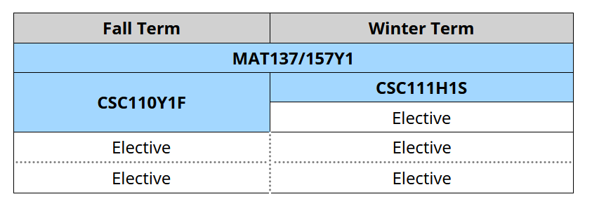
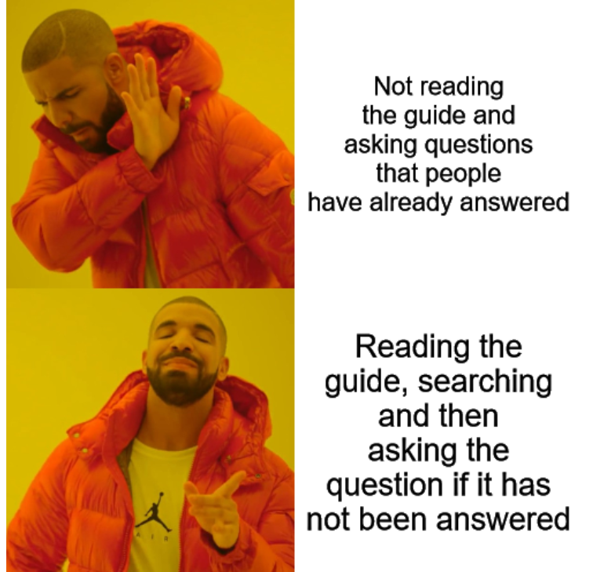

# First Year's Guide to CS

2020 Updates

By: Anujan M - Class of 2020, Computer Science Specialist, Host of Room 2250 S3

Author's Note:  
>After the huge success of the original version of the guide I thought it was a good idea to go through a full edit of the guide and bring it up to date with new content (especially since there has been a lot of changes in the program and that made the old guide almost irrelevant). (That also includes GIFs and links to Podcast Episodes hosted by yours truly).  
>
>As much as I would like to say this guide is accurate (yes, disclaimer time) this is by no means an "official" guide and is written solely from the perspective of students like myself with sources to official documentation. You should make sure to consult with the Undergrad Office or your college registrar to confirm your understanding of these topics and to verify your plans.  
>
>This is also a **WORK IN PROGRESS** we'll be adding and editing content throughout the summer as new information comes to light.  
>
>Hope you gain something and if you see something wrong raise an issue or even better change it and make a PR. Thanks for reading and I wish you the best in your CS journey!

Original Credits for 2018 Version  
By: Anujan M, Clara S, and the CSSU Team

---

First and foremost, on behalf of the Computer Science Student Union (CSSU), we would like to congratulate students who have received an offer of admission to Computer Science at the University of Toronto St. George campus. (If not, well, we hope you are considering it – or we hope that you get an acceptance!). We're happy to have you!

This is a collection of Frequently Asked Question (FAQs) which we think all first-year undergraduates (and everyone in the program, in general) should know. This is part of a multi part project to curate resources for the entire CS community some who's links will be in this guide.

University can be daunting, especially in your first-year. This year especially with the pandemic affecting all aspects of our lives mentally and physically. We hope this guide gives you some information and tips on how to make sure that you are successful on your first-year here (and we hope this guide makes you laugh along the way). If there is anything you want to add or edit on this guide, please send the CSSU a quick email or make a PR on the Github Repo. So strap in this is pretty long feel free to read in chunks or binge.

## Table of Contents
1. [What is the CSSU?](#what-is-the-cssu) (Ice Cream Sandwiches and Video Games)
2. [Common Terms that you should know](#common-terms-that-you-should-know) (or Uni is just full of acronyms that change all the time)
3. [Course Enrollment](#course-enrollment) (or how to make a schedule that doesn't overburden you)
4. [Course Tips](#course-tips) (or how to actually succeed in those courses and GET HELP)
5. [Program Admission (Formerly Subject POSt)](#admission-to-a-program) (AKA most speculative/invisible monster to terrorize students in all of Canada or even the world that got a rework into a much nicer thing but is still worth paying attention to)
6. [Mental health](#mental-health) (Really important to read and understand, it's real and we need to talk about it)
7. [How to get involved?](#how-to-get-involved) (or how to get a balance in your life, have fun and make friends)
8. [Jobs/Internships/PEY](#jobs-internships-and-pey-co-op) (or how and when to get some real-world experience)
9. [Links to Know](#important-links) (KEEP THESE HANDY)
10. [Finances](#finances) (Why CS costs more and how to reduce these costs)
11. [Parting Words](#parting-words)

## What Is The CSSU?

So since this guide is made in coordination with the CSSU, we would like to introduce you to them. The Computer Science Student Union (or CSSU in short) represents all Computer Science students who are either taking a Computer Science course, or are a part of the Computer Science program (Minor/Major/Specialist) at the U of T St. George campus. They offer a variety of services, and sell drinks and snacks (and ice cream sandwiches!) out of their office in **BA2250** (Bahen Centre for Information Technology, 40 St. George Street, 2nd floor) when it eventually reopens. 

CSSU also hosts a variety of events, including Games Night, where students have the opportunity to socialize with each other over games of all kinds, all night long. They also have lots of video games and consoles in the office, from the Gamecube (for Smash Bros.) to the Switch (Super Smash Bros Ultimate) and an Xbox One and Playstation 3 for you to play with your friends, or make new ones. Feel free to drop by, say hello, and introduce yourself! You can sign-up for their email newsletter that will contain information on upcoming events [here](https://cssu.us10.list-manage.com/subscribe/post?u=987f258df56af54075e2c9696&amp;id=6217e7727d)  

They also support CS Frosh, which happens at the beginning of the year for students to get to know each other and to be introduced to some great info. Stay tuned for more details later this summer on how we're reworking it for 2020!!

---

## Common Terms That You Should Know

**ACORN**

[ACORN](acorn.utoronto.ca) is your one stop shop for all the official things you need to do. From enrolling in courses and accessing your final grades to finding your tuition bills, ACORN is your go to site.

**_ProTip_**: You can plan your courses on ACORN and save them to your "cart", from which you can quickly enrol when it's time to enrol in courses.

**QUERCUS** (A.K.A. Portal, or the most unpronounceable name on campus)

[QUERCUS](q.utoronto.ca) is the new system (now two years old) which most courses use to provide lecture slides, important dates, and course updates (previously, it was called Blackboard and some people still do call it that). You can also submit your assignments, and sometimes access your term marks (tests, quizzes, assignments etc.) through this system. CS courses tend to use their own sites in conjunction with MarkUs (see below), but most other courses are adamant on using it (though some courses use other tools as well, so you should make sure to check the syllabus of each one of your courses to see what they are using). If you've used D2L or Blackboard, then you'll find that QUERCUS is a bit familiar. 

**MarkUs**

[MarkUs](markus.teach.cs.toronto.edu) is where you'll be submitting your work and getting feedback and marks for most (if not all) CS courses. Make sure that you can login to the site as soon as it’s available in order to avoid hassles which will undoubtedly arise if you can't login on the day your assignments are due.

**_ProTip_**: Always submit assignments early, since the system tends to get overloaded and is known to get extremely slow or even crash during the last few minutes before the deadline. It’s your personal responsibility to submit early, and you should keep in mind that multiple submissions are allowed for most courses. This means only your final submission will be graded, even if you submit various drafts of your work prior to the deadline. This allows you to edit and submit your work as many times as you see fit until the deadline.

**Piazza**

Piazza is what many courses use as a course forum, where people can post questions and get answers from classmates and even professors/TAs. Some courses, however, don’t use Piazza and instead use Discourse or the Quercus discussion boards. These are good resources for finding answers to frequently sought out clarifications. 

**_ProTip_**: Remember to search your question before posting it on Piazza, because it is very likely that one of your classmates will have already asked that question earlier. Also profs really don't want to answer the same question 5 million times.

**Teaching Labs**

The teaching labs refer to not only the actual labs in Bahen, but also to the whole online system through which you are interacting with the department (MarkUs, SSH (_Remote Lab Connections_), PCRS). At the beginning of the year, you'll get an email asking you to set up your Teaching Labs account. It is very important that you: 
1. don't lose the email  
2. don't forget the password you set it with.
This is the most used login you'll need at U of T (after your UTORid login for ACORN). Also know that as a CS student you get access to the labs (and Bahen) 24/7 with your T-Card. For more information about the labs visit [their site](https://www.teach.cs.toronto.edu/)

**Help Centre**

As one of the best places for you to get official help in first and second year courses, the CS Help Center which is located in Bahen has TAs and professors ready to help you when you have questions. For a full schedule of when it’s open and who's there, visit [this link] (http://web.cs.toronto.edu/program/ugrad/ug_helpcentre.htm). For upper year courses, you should be able to get the help directly from the course-specific instructors/teaching assistants (TAs), rather than general Help Centre TAs. Getting help is really important, and you should make full use of these hours. **Note for this year it is unknown how the help center will be ran look for updates from your profs.**

**Undergraduate Office aka “UGO”**

For all your official program questions and concerns, make your way up to the 4th floor of Bahen to visit the undergrad office for CS. You can ask them questions ranging from program admission to financial situations, or anything to do with the CS program at all, and they will be willing to help you out. If you need any CS advice, the office is a great place to get the official answers to all/most of your questions. 

---

## Course Enrollment

So the first rule of CS is to be lazy (when coding) and to avoid remaking the wheel (or the print statement). Since the Faculty of Arts & Science has already videotaped, asked, and subtitled videos on how course enrollment works and on great tips for University, we are just going to link them here. (These were made 2 years ago but the advice still holds) These star some of the best CS students we’ve ever had the pleasure of knowing, and their advice is actually really great. Stars 2020's John H. Moss Scholar, Former CSSU General Council Member, TA, and Frosh Organizer **Lana**; Former CSSU Vice President, UofT Hacks President, and TA **Calvin**; and 2017 Canadian Undergraduate Computer Science Conference co-chair and TA **Felipe**. 

Click on the title to watch the video on Youtube (It does have subtitles so yay)

[**Preparing for course enrollment and what you should know**](https://www.youtube.com/watch?v=MNn98NhAza8)

[**Avoiding Burnout (and how to move on from failure) with Felipe**](https://www.youtube.com/watch?v=FzrPswwkZFs)

[**Getting to explore different fields and how that's important with Calvin**](https://www.youtube.com/watch?v=YgUDhDLpZAo)

[**UofT time and how you can have two classes back to back without the need for teleportation with Lana**](https://www.youtube.com/watch?v=Sq54k8gbN8w)

[**Calvin’s Insider Tips**](https://www.youtube.com/watch?v=RW_Mr85HFto)

A good tip from u/zyjerry: You can access course evaluations submitted by past students for more courses on [Quercus](q.utoronto.ca). Just have to login (with your joinID which will soon become your UTORid) and select course evaluations from the drop down menu. You cannot see specific comments written by students, but you can see the numerical stats. Great way to learn about electives.

For more important videos with more tips and information about university and course enrollment check out the ArtSci Youtube channel [here](https://www.youtube.com/channel/UCXRrb_NqDU5IN2ensLpWbcg/videos) and for an interview with Lana about her achievements and advice check out [this episode of Room 2250](https://open.spotify.com/episode/3HZ6rqlLT1n07o1Rn2xLzQ).

#### **In Stream** Schedule Notes

Visit [here](https://web.cs.toronto.edu/a-new-first-year-experience) for more information about the new courses and the new first year experience.

For students in-stream there is a special course selection note that is different from past years. (Technically its the first time that a course like this has been offered in a fall semester). CSC110Y1 is a 1 semester course but its a full credit course. This means that its the equivalent of 2 normal *half year* courses, there will be double the amount of lecture time and you'll earn a full credit on completion of the course. CSC111 is a normal half year credit course that you'll take in the winter semester.

This means that you must plan your course load accordingly. If your following a typical 5 credit per year full-time course load you would split that as 2.5 credits per term. That is 5 half-year courses per term. (Full Year courses such as MAT137/MAT157 take a half credit per term) CSC110 would take 2 of those 5 spots leaving 3 electives (1 which would be taken up by MAT137/MAT157). In the spring semester 1 spot is taken by CSC111 and 1 by the math course leaving 3 electives. Below is a sample look at a timetable that summarizes this.

## Course Tips

#### Students that have been admitted to the CS Stream

This is the first year with the new stream program. With it came two new courses, CSC110Y1 and CSC111H1. These are meant to replace CSC108, 148 and 165 for stream students combining all three courses to allow for students to be together as a cohort through first year but to also combine theory and practice more tightly than was previously available with the three course split. If you have no prior experience with programming thats okay these courses don't expect previous programming knowledge. They are meant to cover the same topics as 108,148 and 165 and as of writing will still use Python.

Visit [here](https://web.cs.toronto.edu/a-new-first-year-experience) for more information about the new courses.

#### Students that were not admitted to the CS Stream (Mathematical and Physical Sciences, Life Science, Humanities etc.)

##### CSC108 vs CSC148

So many students ask whether they can skip CSC108 and just do CSC148. The answer is really dependent on you and your abilities, and you won’t be favored for admission to the program if you take CSC148 during first semester instead of second semester. 

- If you’re new to programming, you should take CSC108 since it’s for beginners, and will give you the required preparation for CSC148. 
- If you’re experienced with programming, you might want to talk with someone at the Undergraduate Office to see if you will benefit from skipping CSC108. If you do end up directly progressing to CSC148, there are ramp-up sessions held during the beginning of the semester to help you brush up on the contents of 108. 

Alternatively, you could also take a look at a [past final](http://www.cs.toronto.edu/dcs/ugdocs/csc108.pdf) from 108, or look at the ramp up slides online to get an overview of CSC108. If you feel like you don’t understand it completely, you might want to take CSC108. (Think about the best thing for you as a student – it’s about learning the material to the best of your abilities, not about ‘saving’ a half credit). Both courses are in Python, so even if you’re familiar in Java, you might want to take CSC108 just to get familiar with Python. Consider your options well. 

Note that even if you take CSC148 and then decide that you're not ready for it after taking a few classes, you can drop down to CSC108 if spaces are still available in that course. 

Also look on the department’s [page](https://web.cs.toronto.edu/undergraduate/first-year-courses) for more info on how to choose your first-year CS courses (This doesn't mention the new in-stream version refer to the above section for more on the in-stream site).

#### Which Math Course Should I Take?

So yes, you’re thinking  – this is a CS guide! Why is it talking about math courses? Well, Mathematics and Computer Science go hand-in-hand (in particular, CSC165 and all the theory courses have a very mathematical approach). We are very much like our math counterparts on the theoretical side. This is the reason why you will have to pick a calculus course in your first-year, and your options are highly varied. 

The courses offered are MAT135/136, MAT137, and MAT157. Either of these will satisfy the program requirements if you are entering from out of stream, but 137 and 157 are more theoretically heavy (and mandatory for those in-stream or wishing to do the Data Science Specialist), and great proof preparatory materials. If you are considering a math specialist, you should take MAT157 since the math specialist only accepts MAT157. Otherwise MAT137 will also prepare you for the level of proof material in CSC165 compared to MAT135/136 which do not cover proofs. MAT137 is also the calculus course which is recommended by the CS department (and is mandatory unless taking 157 for in-stream students). MAT135/136 are more computationally heavy courses which do not help you with proof practice, but they fulfill the program requirements nonetheless.

While we talk about the Math Specialist if your interested in taking a Math Major or Specialist you must take MAT223(Major)/MAT240(Major or Specialist) and MAT224(Major)/MAT247(Major or Specialist) (Linear Algebra I and II) in your first year. For everyone else it is not mandatory to do in first year but you must take at least MAT223 as part of the CS program requirements (most do it in their 2nd year), and some CS 3rd and 4th year courses require it. For more info check out the [math section in the calendar](https://fas.calendar.utoronto.ca/section/Mathematics) for full details.  

Do your due diligence and remember that if you take a more advanced course, you can normally try it out and drop down to the comparatively less dense math courses in the first 2 weeks (or more) with no penalty (the same doesn’t apply going up in difficulty). If you have any concerns, contact the math department. They have also provided some good prep work for first year calculus [here](https://www.math.toronto.edu/preparing-for-calculus/).

#### How Should I Take Notes?

There's no real definitive answer to this question. Many people prefer writing with pen and paper, and it does benefit you in math and theory courses, where there are lots of complex formulas and mathematical notations to jot down (you probably wouldn’t want to type them out). Lots of people swear by the fact that writing by hand is better, though some people also like typing everything out instead. For programming courses, coding along with the professor is sometimes a great idea to see the lessons in action, though those courses normally have slides which you can read afterwards to catch up as well. Whichever style fits you is the one you should adopt. 

#### What type of Laptop/Computer Do I Need?

Before the pandemic this was a question with no definitive answer. Technically, you didn't need one, since you have 24-hour access to the Bahen labs, and can write all of your assignments there. But since COVID-19 has resulted in classes being online (or with limited in-person sessions) for the most part you will need access to a computer. It's recommended that you should get a laptop, since you probably don’t want be stuck in the labs all the time and you can use it when you get on campus. You don’t need the most advanced system in the market, and you should get something that fits your needs and budget. The university has provide a list of minimum and recommended specs for doing remote learning [here](https://www.viceprovoststudents.utoronto.ca/covid-19/tech-requirements-online-learning/) which also include having a webcam available. If you are attending classes from outside of Canada the site also provides important information about VPN access if necessary.

#### Online Learning

Due to the pandemic this is a new reality. You may decide (or be forced to) take courses online, (maybe for an entire semester or the year). This is a significant change and needs its own conversation. Online learning may be new for a most of you (you most likely had a bit of experience with it earlier this year). Here are a few tips and tricks to help manage online learning.

1. Find a workspace that works for you  
   Make sure that you have a space where you can work productively, if needed away from distractions, loud noises and that is comfortable. Having a routine and constant space that is your study space will help to focus and concentrate along with having all your school stuff in one place.
2. Plan out your time  
   Make sure you have a schedule and keep to it. Some of your courses may be synchronous and "force" you to attend at a certain time, use that to your advantage. Others may have their materials as VODs and these courses are the ones you need to make sure your not falling behind on. Set specific times that you'll work on each course. For courses that upload materials plan your study times around the material posting schedule. **Stay Alert for messages from your courses**, check email regularly and Piazza/whatever discussion forum the course uses.
3. Set Alarms  
   With technology you can harness the power of nagging alerts and calendars to make sure you remember your classes and assignments. When you get your course syllabus make a note of all the important dates like assignments and tests on your calendar. If your like a lot of people you might lose track of time when your concentrating causing you to miss a class or worse a test. Make sure you have alerts and make a habit to check your calendar every week and every day to make sure your on top of things.
4. Make use of the university's online programming  
   [Hart House](https://harthouse.ca) offers online fitness classes on Zoom, and also writing and art community activities. When campus is open they have a gym and host lots of activities.  
   On [CLNX](clnx.utoronto.ca), you can register for Virtual Study Hub so that you know that you are not alone studying. This can also increase your motivation and concentration. VIrtual Study Hubs take place from Monday to Sunday from morning to afternoon.  
   Look in your college's newsletters there may be virtual programming for their members.  

#### Tips

So you’ve gotten into the courses you like, and you’ve planned out your timetable well. Now, you need to succeed in them! How do you learn the content well, and get a decent grade? Here are some best resources to help you succeed.

1. **Attend Lectures**

   Lectures are the main way you are taught the course content, and you shouldn’t be afraid to ask questions during lecture or even before or after the lectures if you don’t understand something. If there are multiple lecturers teaching the same course, try to attend 1 lecture of each lecturer, to see whose style resonates with you best (and fits your schedule). However, you should read the syllabus carefully to see if the course is designed in such a way that auditing different lecture sections doesn’t negatively impact your grade (some courses have lecture section specific midterms, or participation marks which you can only earn in your own lecture section).

2. **Attend Tutorials**

   As former TAs, we truly believe that tutorials are the best way to check if you know what you’re doing. During tutorials, you can get lots of practice, ask questions, and get instant feedback from your TA and your peers in a smaller group setting. You should take advantage of your TA, in any of the courses that have them. They are paid to help and support you do your best. They also give great advice (cough cough).

3. **Office Hours**

   While Office Hours may sound daunting, they are not. Most (if not all) professors love it when students come to office hours with good questions and concerns. Also, if they’re not too busy, you can ask them questions about their research or general CS questions – they are some of the most experienced in the field, and this is a great way to build up a great prof/student relationship which can help you later on (references for grad school or research opportunities, for example).

4. **The Help Centre**

   As mentioned above, the help centre is a great place to ask TAs and profs questions that you may have about the course content and assignments. Keep it in mind that it can get very crowded near a deadline (procrastination at its finest). However, it's still a great way to get help (also, Piazza is an excellent resource if you need any questions answered).

5. **Assignments**

   When it comes to assignments, don’t start the day before – this doesn’t only make you extremely stressed, but also gives you no time to ask questions about the assignments if you get stuck. Start early, make a list of questions to ask, and go to office hours to get those questions cleared up. Also, don’t copy off of other students – plagiarism is bad, like – it's [serious business](http://www.artsci.utoronto.ca/osai/The-rules/what-is-academic-misconduct). The department has very high-tech tools to catch you, and they will. It's never worth it. If something comes up and you need help, talk to your prof and they will try their best to help you. 

   Also, make sure that your code runs on the lab computers (this may sound crazy, but people have submitted assignments that error out because of the following two things):
   1. They didn’t submit the right file or it had an error, or
   2. Their computer inputted a random non ASCII character and the lab couldn't parse that file, resulting in a 0 because it didn’t run. 
   3. The Teach CS machines are Linux. If you write your code on a Mac or Windows machine, or even a Linux machine with a different configuration your code may depend on libraries or encoding that do not match the teach.cs machines and will not run.
   
   So, how do you prevent this? It’s simple – submit early, download your code off of MarkUs to a lab computer, and run it! If it runs in the lab, it will run while grading. Even if it runs on your computer fine, that is not a valid reason for it to run properly while grading – **IT MUST WORK ON THE LAB COMPUTERS AS WELL**. Also, check your language settings on your computer – non-english characters have been known to mess-up the file, rendering it unrunnable on the lab computers (its weird, we know, but you should opt to be safe, rather than sorry).

   Another important thing to keep in mind is the ethics of copyright and code sharing. Most students think that after they have completed their assignments, they can post it on their Githubs and add it to their portfolios. The reason why this might not be such a good idea is because these assignments have a lot of starter code prepared by your professors, and sometimes profs like to reuse these assignments. You should always ask for the permission of your professors before posting your assignments on public platforms like Github. Otherwise, you could be held accountable for plagiarism even if you didn't commit it yourself - as a student taking the same course in later years might find your assignment and copy it.

---

## Admission to a program

Ok, now for the big CS elephant in the room – admission to the program, which is declaring your Minor, Major or Specialist in Computer Science in second-year. 

Here at St. George, the Faculty of Arts & Science has this policy in which it encourages the exploration of different fields, and makes it easy for students to switch majors and subjects after their first-year. This is the reason why you can’t choose your Majors/Minors until the end of first-year. The issue with Computer Science admission is that there are not enough resources/spaces to give every student who wants to choose CS after their first-year a spot, so the department has to institute a certain cut-off average as a requirement for students to get into the program. 

There are two separate set of requirements depending on wether you are in stream or not. (In stream meaning you have been admitted to computer science from high school). **THIS IS BRAND NEW FOR THE 2020-2021 ACADEMIC YEAR** and represents a significant change from years prior.

Listen to the Room 2250 Podcast Episode with Undergrad Chair Michelle Craig to talk about the new changes [here](https://open.spotify.com/episode/6uO80FhdIXgiE9VWxywJdN)

#### In-stream

Requirements as quoted from the ArtSci Calendar are:

>- Completion of at least 4.0 FCEs
>- Complete the following Courses with the minimum grade
>      - CSC110Y1 (70%)
>      - CSC111H1 (77%)
>- Take and Pass either of MAT137Y1 or MAT157Y1

This is a huge change from prior years where the variable cutoff exists. This new format is here to provide a sense of stability and allows you to set a clear goal and focus on the course content.

- There is no reason to be scared that you will not meet these requirements, as the instructors are not there to weed students out. They are there instead, to make sure that you are prepared, and that you understand the content well. 
- These two courses (CSC110 and CSC111) are an important base. If you don't find their content to be conceptually appealing, it’s possible that you might not enjoy your upper-year CS courses at U of T as well. These requirements are not there to cut down the number of people, it is hoped that all students in the stream are able to meet the cutoff and proceed in the program if they choose.

To quote from the department itself:
>We anticipate that the vast majority of the students will meet the requirements of the guarantee after first-year and will be admitted to a Computer Science Specialist, Major or Minor.  In fact, if every student meets the admission guarantee conditions then every student will be admitted.

#### Out of Stream

The requirements as quoted from the ArtSci Calendar are:

>Special Requirement
>Students who do not have the Computer Science Admission Guarantee must complete a supplementary application to be considered for the program.
>
>Variable Minimum Grade
>A minimum grade is needed for entry, and this minimum changes each year depending on available spaces and the number of applicants. The following courses must be completed:
>CSC148H1 and (CSC165H1 or CSC240H1)  
>
>To ensure that students admitted to the program will be successful, applicants with a grade below 70% will not be considered for admission. Obtaining this minimum grade does not guarantee admission to the program.
>
>Notes:
>Requests for admission will be considered in the first program request period only.
>Due to the limited enrolment nature of this program, students are strongly advised to plan to enroll in backup programs.
>Students admitted to the program after second or third year will be required to pay retroactive deregulated program fees.

So after reading this, most students panic and ask: “What's the cutoff?” Well, we wish we could give you an answer, and we wish that the department could give an answer, but it’s not that easy. 

- The cutoff is not an arbitrary number, say 60 or 75, like some other programs. In reality, the cutoff for CS is the top x number of student averages from 148 and 165 that have applied to the CS program who are not in-stream, where x is the number of spots in the program for that year after in- streams have been admitted. 
- The specialist/major cutoff for 2018 was 83 for in stream students and 86 for out of stream students. For the CS minor, the cutoff was 80 for both in stream and out of stream students. This may go up or down in the upcoming years depending on future circumstances. 
- This is high. Is it impossible, no. So is it doable? Yes, but only if you put a lot of work and effort into the required courses. 
- The number of program spaces has remained relatively constant over the last two years, and there are more program spaces available than the number of students in the first-year computer science admission stream.
- There is no reason to be scared, as the instructors are not there to weed students out. They are there instead, to make sure that you are prepared, and that you understand the content well. 
- These two courses (CSC148 and CSC165) are an important base. If you don't find their content to be conceptually appealing, it’s possible that you might not enjoy your upper-year CS courses at U of T as well. 
- Always keep your options open. As mentioned in course enrolment section, take some breadth courses, and maybe you'll enjoy them and will want to pursue them further. The great thing about U of T is that it has a plethora of awesome programs which you can choose from.

They also ask whats the supplementary given information from what happened the past year its basically a way for the department to get to know you. It will ask about your experiences and gets to know you. They will do random interviews so make sure your truthful.

For more info visit the [CS Department Admissions Page](http://web.cs.toronto.edu/program/ugrad/admission.htm)

#### *NEW* What if I want to pursue Data Science?

Data Science is a recently added specialty that is co-offered by the Department of Statistics and Computer Science. As quoted from the [calendar](https://fas.calendar.utoronto.ca/section/Computer-Science#programs_view-block_2-0) The Data Science Specialist program prepares students for work in the Data Science industry or government and for graduate studies in Data Science, Computer Science, or Statistics. Students in the program will benefit from a range of advanced courses in Computer Science and Statistics offered by the University of Toronto, as well as from a sequence of three integrative courses designed especially for the program.

There are specific admission requirements that first years must complete on top of the existing CS requirements.  

>    CSC110Y1 and CSC111H1 or CSC148 and CSC165  
>    MAT137Y1 or​ MAT157Y1  
>    STA130H1 **Difference**  

To ensure that students admitted to the program will be successful, applicants will not be considered for admission with a grade lower than 70% in CSC110Y1, CSC148, CSC165, MAT137Y1, and STA130H1, or lower than 77% in CSC111H1. ( MAT157Y1 grades will be adjusted to account for the course's greater difficulty.) Obtaining these minimum grades does not guarantee admission to the program.

If you were admitted as an in-stream computer science student you have an additional benefit. **At least 20 spots** will be reserved for in-stream CS first years who complete the requirements. In other words out of the in-stream first years that apply for the data science specialist the top 20 (or more) will be admitted to the specialist. The rest may get in if their grades are competitive (like non-stream students). The rest will be combined with the out of stream applicants and the spots will be given in order from highest to least average like the CS out of stream selection process. Out of stream students will also need to complete the supplemental application like for CS.

**NOTE** At program enrollment time you can apply for multiple specialists/majors/minors. Depending on which ones you get you can choose the set you want to continue with. Backups are important.

---

## Mental Health

Mental health is extremely important, and taking care of yourself should be your first priority. A lot of students find program admission to be extremely stressful, and university in general is a giant leap from high school. Taking a reduced course load, or dropping down from hard courses to easier exclusions isn't something to be ashamed of, and you should definitely do it if you feel like it will benefit your mental health. On the same note, Accessibility Services is something you should check out if you are having any mental/physical health related problems which are getting in the way of your studies. It provides amazing support to those who are registered within it. You can get exam accommodations, extensions on assignments, and peer note takers (amongst many other things), and you will also get your own advisor whom you can go to if you are having problems coping with various aspects of University. They will direct you to many resources, and will help you out the best they can. You can check out their website [here](https://www.studentlife.utoronto.ca/as). Also, the [Health and Wellness Center](https://studentlife.utoronto.ca/hwc) has medical and mental health services to help students academically and personally if you need them. Make sure to make the most of the services which you have access to. The UofT Reddit has a set of [Health and Wellness Resources](https://www.reddit.com/r/UofT/comments/6yxq87/health_wellness_resources/) as well.

Something that I believe in when things get tough is hope. Sometimes things don't work out exactly as we expect. Things go wrong, bad stuff happens but you should never give up on hope, hope that things will be better someday. Keep being true to your self, work towards your goals and never give up.  

Another thing which we want to mention is that collaboration and teamwork can help a lot when it comes to dealing with the pressure of assignments and midterms. Yes, acceptance into the Computer Science program is competitive, but helping each other out and learning from each other goes a long way. Make friends!!! Everyone is scared, stressed out, and just wants to do well. Help each other out, and be kind to one another. Please don’t expect to go solo on all your classes – you are surrounded by some of the brightest students in your year, take advantage of that! University is a lot less stressful if you have like-minded friends to help you along the way.

### Finding your community

The University of Toronto is a diverse campus with students from around the world and from every walk of life. People are unique and share different beliefs and values. There is a community for everyone. No matter your race, sexuality or religion you should feel like you belong. This is a two way street. Treat people with respect, accept opposing views, show compassion and kindness. The actions you take make our community more inclusive and more diverse. Racism exists, even at an academic institution like UofT, I hope that people reading this will think about this and their actions. If you feel like you don't belong there are groups, communities and good people on campus that can help you. Never lose faith in humanity.  

---

## How to Get Involved

Having a school/life balance is especially important when you’re in university. While there may be an immense pressure from academics, you should make sure you give time to yourself as well. You can check out this huge list of clubs and student groups which you can join [check this link](https://www.ulife.utoronto.ca/), or visit the clubs fair during the first week of classes. For more CS related clubs, do check our list of CS clubs [here](https://cssu.ca/clubs/). 

To hear about experiences from two clubs WICS and UTCG take a listen to these two episodes of Room 2250:  
[WICS](https://open.spotify.com/episode/0miTXJpfrMTo1XsnRjh4yQ?si=xC03o9NUSb-U-eBb4gnapg)  
[UTCG](https://open.spotify.com/episode/1r9rMTmdCu3GRcFFSDAQfr)  

You might also want to consider joining a FLC (First Year Learning Community). Basically, you get a group of other students who are taking the same Computer Science courses as you, and you get an upper-year mentor along with department members who will help guide you though your courses, uni, and life in general. It helps you make some friends, be in the know, and get some real mentorship. Check out more info and apply [here](https://learningcommunities.utoronto.ca/index.php/ex-1/find-your-flc/computer-science/).

Also, do take a look at applying to be a First-year Representative here at the CSSU. You will be responsible for presenting your interests and issues to the CSSU, and for spreading information and updates to your classmates. Alternatively, you can also be a General Council member – check out the main page for more details on how to apply!

There are also lots of events which you can attend and participate in – follow us on Facebook and Instagram to get updates on all the events which the CSSU runs! 

There are a lot of hackathons which you can join (for those of you who don’t know what a hackathon is, it’s basically a 1-3 day event where you and your team get together to build something, like an app which solves a real-world problem, or just something which you think is really cool in general - and you can win prizes for it and get free food!!!) Its free about 95% of the time, and you get the opportunity to meet lots of company reps. UofTHacks is our premier hackathon, so be on the lookout for more details later this year. Also, check out [MLH](mlh.com) for a full list of hackathons both in Canada and around the world (A lot of the US ones are popular as well, if you’re comfortable with going to the United States for a weekend). Remember, you don’t have to be experienced to go attend a hackathon - there are lots of workshops offered throughout these events, and you can always just go for the experience, which we can confirm is awesome.

---

## Jobs, Internships and PEY Co-op

So yes, everyone wants to get some experience in “the real world” and make money – uni is expensive, and living in Toronto is expensive. So, a job which actually relates to your studies checks off all those boxes. There is a wide range of job opportunities which you can consider. As a first-year student, you should definitely look at some of the major company internships that are dedicated to first- and second-year students: Google’s Engineering Practicum and Microsoft Explore are two of the bigger programs. Also, startups are a great way to get into the door and get some experience (though do your due diligence, because unpaid internships are very uncommon in CS, so make sure you know what you’re getting into before committing). For good interview questions prep, read “Cracking the Coding Interview” (CTCI), as it’s very informative and has lots of great problems in it. The CSSU has made another Github Repo with job resources and tips [here](https://github.com/cssu/job-resources).

If industry is not your cup of tea, then there are a lot of research opportunities for students if you are persistent enough to pursue them. After your first year, there are second-year research programs run by the Faculty of Arts and Science [click for more details](https://www.artsci.utoronto.ca/current/academics/research-opportunities/research-opportunities-program) where you can get real research experience and a course credit, either in the summer after first year, or during your second-year. There are also a lot of open source projects which you can contribute to, both at U of T (PyTA, MarkUs…) and outside of university (Google’s Summer of Code is a great place to find open source projects, and Google pays students during the summer for working with them).

For more information on undergrad research listen to Room 2250's Episode on [Research with Prof. Jacobson](https://open.spotify.com/episode/21sur5j3l2h23IFP5E0Fp4).

The Professional Experience Year Co-op Program, administered by the Engineering Career Centre, is another option which you can consider after your second-year, or after your third-year of studies. It's basically a 12-16 month paid position where you work at a company (you do have to apply and interview for a position, one won’t be given to you), and get some experience before you complete your studies. For more information about PEY Co-op for computer science, visit [the department page](https://web.cs.toronto.edu/undergraduate/pey) and [the Engineering Career Centre site](http://engineeringcareers.utoronto.ca/work-experience-programs/professional-experience-year-co-op-program-pey-co-op/) for more information and stats.

---

## Important Links

Click on any of the links to go there:
<!-- - [CS Community Team]() (Use your UofT Email to make an account on the page) Coming Soon-->
- [Department Discourse Page](https://bb.teach.cs.toronto.edu/)
- [Room 2250 Podcast](https://open.spotify.com/show/3dNTFMwEqbXO7fosklIP0m)
- [ArtSci Site](http://www.artsci.utoronto.ca/current)
- [ArtSci Guide to First Year](https://newstudentguide.artsci.utoronto.ca/)
- [Services and Resources](https://newstudentguide.artsci.utoronto.ca/resources/)
- [CSSU Resources Github](https://github.com/cssu/)
- [UofT Reddit](https://www.reddit.com/r/UofT/)
- [CS Career Questions Reddit](https://www.reddit.com/r/cscareerquestions/)
- [Signup for the CSSU Newsletter](https://cssu.us10.list-manage.com/subscribe/post?u=987f258df56af54075e2c9696&amp;id=6217e7727d)
- Also, read the department emails that you get as they have awesome information.

**_Disclaimer_**: On Reddit, the most vocal accounts often tend to be those of students who are misinformed. You can still find lots of good information and discussions on the UofT subreddit, but you need to learn how to filter through the misinformed comments and avoid the trolls. Always make sure you are well informed.

---

## Finances

So CS is a deregulated fee program, so it’s more expensive then "regulated" tuition. Since you’re not considered a “Computer Science Student” in first year, you don’t have to pay the deregulated fees. Instead, you pay regular regulated “Arts Science” Fees. However, once you are accepted into the program, you will face the brunt of CS and deregulated fees. Starting from the summer after your first year, your fees are about double the regular tuition fees. These deregulated fees aren't because U of T wants to take all your money, but rather because the government believes that you can get a job out of undergrad, in high demand, pay any student loans faster, so you can afford it (just like engineers and business students), wether thats true or not depends on your point of view (this decision was made in 1998 at the height of the DOT-COM era).

However, you can still get loans, such as the Ontario Student Assistance Program (OSAP), which is open to Ontario residents who are Canadian citizens or permanent residents. 

You can apply for it and plan out your finances with their financial calculator [here](https://www.ontario.ca/page/osap-ontario-student-assistance-program)

The good news is that you can qualify for University of Toronto Financial Aid (UTAPS), and the great thing about this program is that you don’t have to do anything after your first-year – it justs uses your OSAP data including your family income and other things (if you are from another province/country check the UTAPS site for instructions on how to apply and criteria). If your OSAP data is low enough, you can get extra money (free money) paid towards your tuition. However, you won’t know this magical amount till late September/early October, though it can be pretty substantial in certain cases ($4,000+ depending on need). 

There are also lots of scholarships available for you, so you should definitely check if you qualify for them (check Google’s scholarships, or visit the UGO for more details on computer science undergraduate scholarships. Alternatively, you can also visit [here](http://www.artsci.utoronto.ca/current/scholarships/scholarships-by-department/undergraduate-scholarships-computer-science) for more details). Also, consider checking out your college registrar for more financial aid options (bursaries and scholarships!).

---

## Parting Words

Well, you made it to the end of the guide! If you read all of it, congratulations and thank you. If not, well, take a break and come back to read the rest. If you just skipped to the bottom, go back to the top and read (why would you skip to the end, thought there would be a summary of the main points?)

We would like to thank all of the people who helped contribute to this guide, making this a possibility.

We hope this guide is informative to you, and if you think your peers would benefit from it too, please feel free to share it with them. If you have any suggestions or comments, feel free to email the CSSU [here](cssu@teach.cs.toronto.edu) or make a pull request/issue on the page in Github [here](https://github.com/cssu/first-year-guide)

We wish you all the best in your first year, and we hope you make the most out of your time here at U of T. We hope to see you at CS Frosh this year!

Original Credits Follow:  
Lead author Anujan M for coming up with the idea of building this guide, and for researching and writing it in a informative, approachable and enjoyable way. Thanks to Nina from the CS Communications Office and Francois Pitt, Associate Professor, Teaching Stream and Associate   Chair, Undergraduate for reviewing this guide for accuracy and correctness, though as much as we like to say this guide is accurate (yes, disclaimer time) this is by no means an official guide and is written solely from the perspective of students. You should make sure to consult with the UGO or your college registrar to confirm your understanding of these topics and to verify your plans. Also, a special thank you to the 2018-2019 CSSU President David Ansermino for his acceptance of this idea, and for letting Anujan run with it. Also, a huge thanks to co-author Clara S for her fantastic editing of this guide, for sharing real first hand tips and experiences, and for making this guide as comprehensive and grammatically correct as it can be. Without her, this guide would not be as nicely written as it is.  

We wish you all the best in your first year, and we hope you make the most out of your time here at U of T. We hope to see you at CS Frosh this year!
